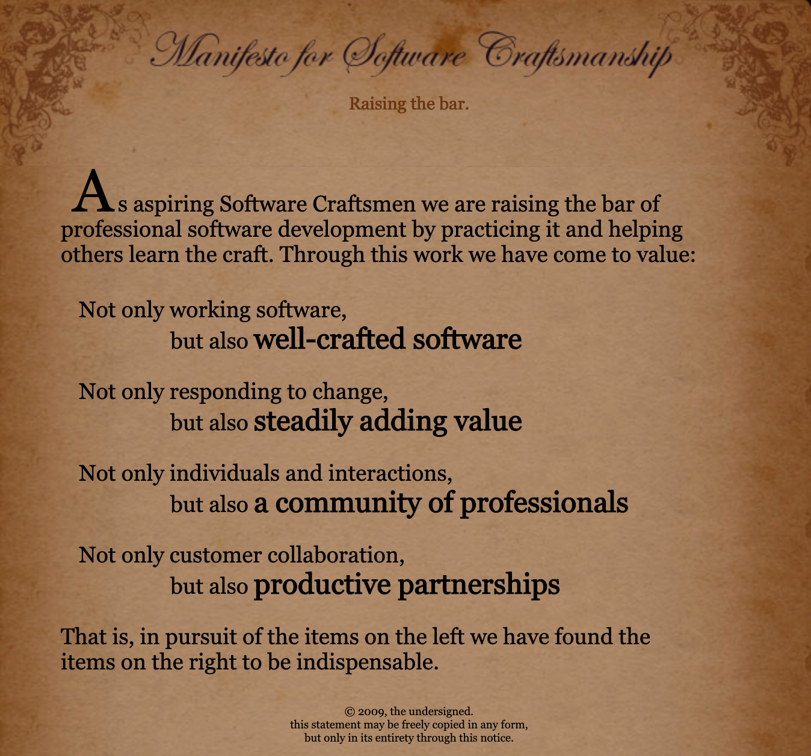
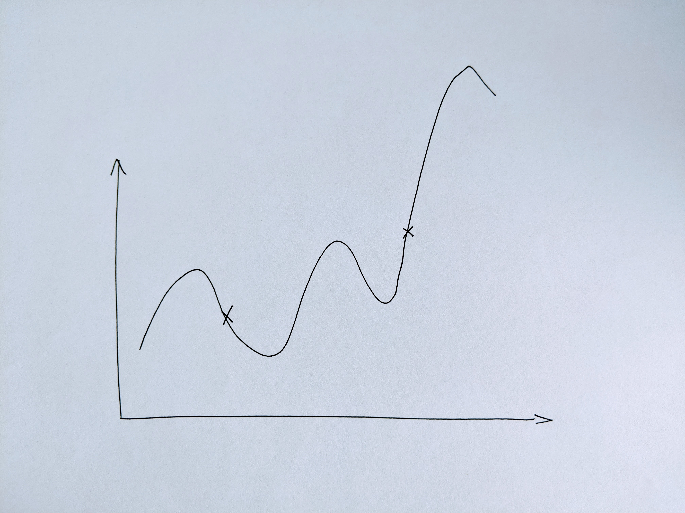
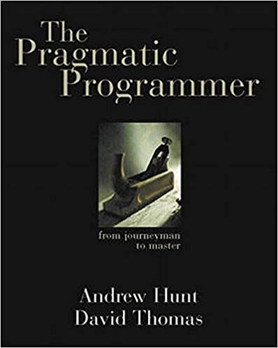

% Part 1
% Testability

# Software Craftsmanship


# Clean Code: on the road to crafting better software

- [TDD](https://www.arolla.fr/training/formations/tdd-test-driven-development/) (Test-Driven Development)
- [BDD](https://www.arolla.fr/training/formations/bdd-behaviour-driven-development/) (Behaviour-Driven Development)
- [DDD](https://www.arolla.fr/training/formations/ddd-domain-driven-design/) (Domain-Driven Design)
- [Casual FP](https://www.arolla.fr/training/formations/casualfp/) (functional programming)
- [Working On Legacy Code](https://www.arolla.fr/training/formations/working-on-legacy-code/) (refactoring)

# Software Craftsmanship



https://manifesto.softwarecraftsmanship.org/

# Software Craftsmanship and Agility

> En 2008, le Software Craftsmanship est réellement né en tant que mouvement alors que Uncle Bob proposa comme cinquième valeur du manifeste agile "Craftsmanship over Execution" [...] Cette valeur n'ayant pas été intégrée au manifeste agile, un certain nombre d'aspirants artisans du logiciel se sont rencontrés à Libertyville dans l'Illinois la même année afin de définir un ensemble de principes pour le software craftmanship.

[Wikipedia](https://fr.wikipedia.org/wiki/Software_craftsmanship#Historique)

# This training is nothing more than a spark


# Kata


# [Kata] The Trivia game

https://github.com/jbrains/trivia

Refactoring, 30'

# Why is testing so important?

- It ensures that the code meets the requirements
- It's a communication medium (Behaviour-Driven Development)
- It acts as documentation ([Living Documentation](https://www.amazon.fr/Living-Documentation-Cyrille-Martraire/dp/0134689321))
- It's a way of discovering a codebase (characterization)
- It ensures there is no regression (refactoring or new feature)
- It allows to clarify expectations and define contracts
- It allows a design to emerge (Test-Driven Development)

# [Kata] FizzBuzz

https://en.wikipedia.org/wiki/Fizz_buzz

1h

# Ways of testing

- No test
- Test after
- Test first
- Test-Driven Development (TDD)

# A test's anatomy

- Given / When / Then
- Arrange / Act / Assert
- Setup / Exercise / Verify

# What shall we expect from a test?

- A test is a necessary condition: if it doesn't pass, there's a problem!
- However, a test is **not** a mathematical proof (in other words: it is not a sufficient condition)

#


#



# What shall we expect from a test?

A test must fail first to avoid false-positive tests (1st rule of TDD)

# Alternative approaches

- [Property-Based Testing](https://fsharpforfunandprofit.com/posts/property-based-testing/)
- [Mutation Testing](https://en.wikipedia.org/wiki/Mutation_testing)

# F.I.R.S.T. principles

- Fast: the tests should run "fast", otherwise you won't run them
- Isolated: tests should be focused and independant, otherwise you'll have a hard time debugging
- Repeatable: imagine a test that passes... from time to time!
- Self-validating: no manual action should be required at any step, otherwise it's time-consuming and error prone
- Thorough: all paths and all edge cases should be tested, otherwise you won't be able to add new features later

# Line coverage vs. cyclomatic complexity

```TypeScript
function addIfStrictlyPositive(a: number, b: number): number {
  let result = 0;
  if (a > 0) {
    result += a;
  }
  if (b > 0) {
    result += b;
  }
  return result;
}

it("should add strictly positive numbers", function () {
  expect(addIfStrictlyPositive(1, 2)).toEqual(3);
});
```

# Line coverage vs. cyclomatic complexity

- Here the **line coverage** is 100%
- But only 1 of the 4 possible combinations is tested:
  - **a>0 and b>0**
  - a>0 and b<=0
  - a<=0 and b>0
  - a<=0 and b<=0

# Dependency Injection demystified

```TypeScript
export function biasedRandomGenerator(): number {
  const seed: number = Math.random();
  return seed < 0.7 ? 0 : 1;
}

it("should return 0 70% of the time", function () {
  expect(biasedRandomGenerator(/* ??? */)).toEqual(0);
});
```

# Dependency Injection demystified

```TypeScript
export function biasedRandomGenerator(
  randomGenerator: () => number
): number {
  const seed: number = randomGenerator();
  return seed < 0.7 ? 0 : 1;
}

it("should return 0 for a seed of 0.5", function () {
  expect(biasedRandomGenerator(() => 0.5)).toEqual(0);
});
```

# Dependency Injection demystified

```TypeScript
export interface RandomGenerator {
  (): number;
}
```

# Dependency Injection

- Constructor injection
- Method / function injection
- Setter injection

# Test Doubles

https://martinfowler.com/bliki/TestDouble.html

# Test Doubles: Dummy

```Java
interface UserService {
  User getById(Id userId);
}

class DummyUserService implements UserService {
  public User getById(Id userId) {
    return null;
  }
}
```

# Test Doubles: Stub

```Java
interface UserService {
  User getById(Id userId);
}

class StubUserService implements UserService {
  final User user;

  public User getById(Id userId) {
    return user;
  }
}
```

# Test Doubles: Fake

```Java
interface UserService {
  User getById(Id userId);
}

class FakeUserService implements UserService {
  final List<User> users;

  public User getById(Id userId) {
    return users.stream()
	              .filter(u -> u.id == userId)
                         .first()
                         .orElse(null);
  }
}
```

# Test Doubles: Spy

```Java
interface UserService {
  User getById(Id userId);
}

class SpyUserService implements UserService {
  boolean methodInvoked = false;
  final User user;

  public User getById(Id userId) {
     this.methodInvoked = true;
     return user;
  }
}
```

# Test Doubles: Mock

```Java
interface UserService {
  User getById(Id userId);
}

class MockUserService implements UserService {
  final Id expectedId;
  final User user;
  boolean methodInvoked = false;

  public User getById(Id userId) {
    if(userId != expectedId)
      throw new AssertionException();
    this.methodInvoked = true;
    return user;
  }
}
```

# The downside: implementation-aware tests

```TypeScript
export function biasedRandomGenerator(
  randomGenerator: () => number
): number {
  const seed: number = randomGenerator();
  return seed < 0.7 ? 0 : 1;
}

it("should return 0 for a seed of 0.5", function () {
  expect(biasedRandomGenerator(() => 0.5)).toEqual(0);
});

it("should return 1 for a seed of 0.7", function () {
  expect(biasedRandomGenerator(() => 0.7)).toEqual(1);
});
```

# Common pitfalls / Good practices

- Fragile tests: tests should make assertions on the behaviour, not the implementation. That's why relying heavily on test doubles, especially spies, is a smell. Ideally, a test should not have to change when the implementation changes.
- (Property-Based Testing to the rescue!)

# Common pitfalls / Good practices

- Take care of the test code as much as the production code: write human-legible, intentful code.
- But don't write clever test code, stay simple and dare duplicating code in favour of greater isolation.

# [Kata] Rental Movie

https://github.com/arolla/kata-refacto-rental-movie

Refactoring, 1h

# Testing pyramid / Testing strategy

https://martinfowler.com/bliki/TestPyramid.html

# Further reading


# Further reading


